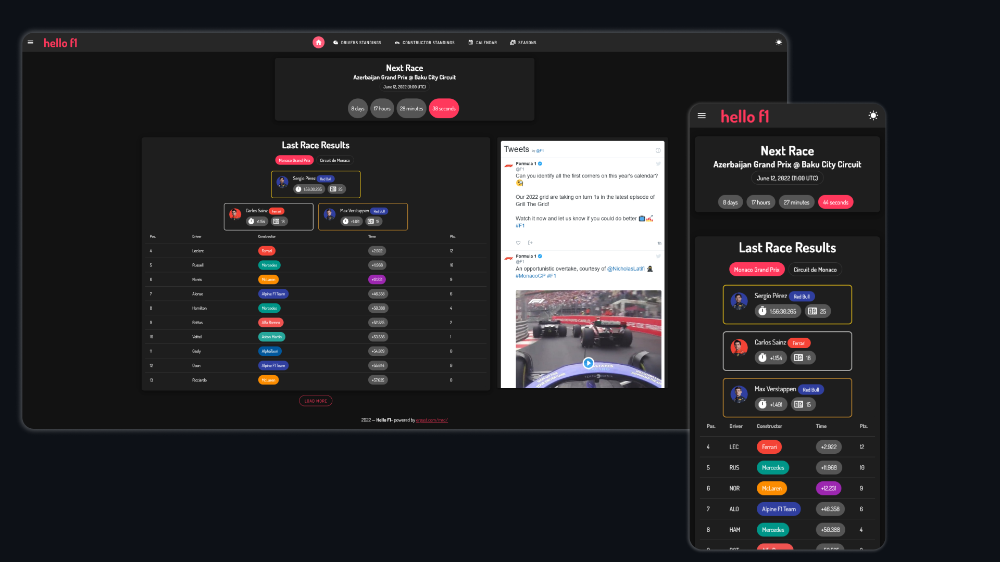

# hello-f1-vue
##
See live at [hellof1.netlify.app/](https://hellof1.netlify.app/)

## Tech Stack

 - Framework : [VueJS](http://www.vuejs.org)
 - UI Library : [Vuetify](https://vuetifyjs.com/)
 - Content : [jolpica API](https://api.jolpi.ca/ergast/f1/)
 - Deployment: [Netlify](https://netlify.app/)
 
## Screenshots

 

## Project setup
```
npm install
```

### Compiles and hot-reloads for development
```
npm run serve
```

### Compiles and minifies for production
```
npm run build
```

### Lints and fixes files
```
npm run lint
```

### Customize configuration
See [Configuration Reference](https://cli.vuejs.org/config/).

